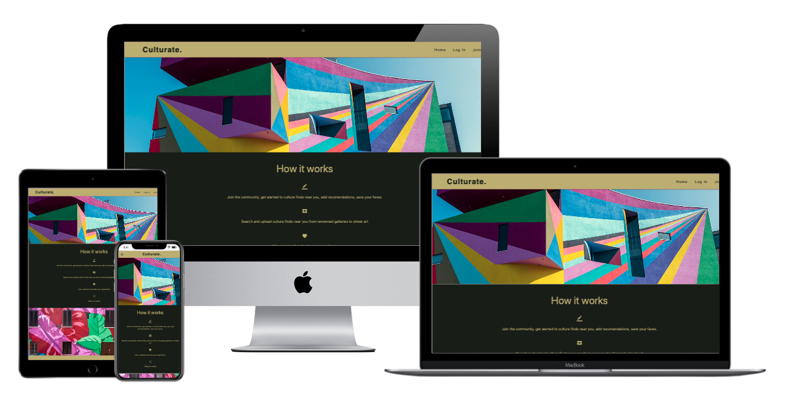
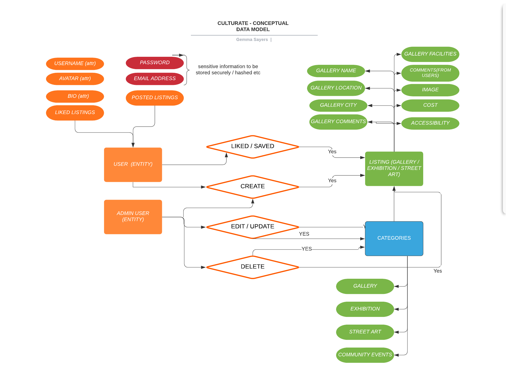
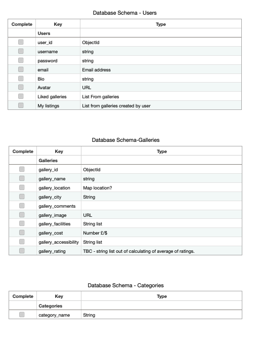
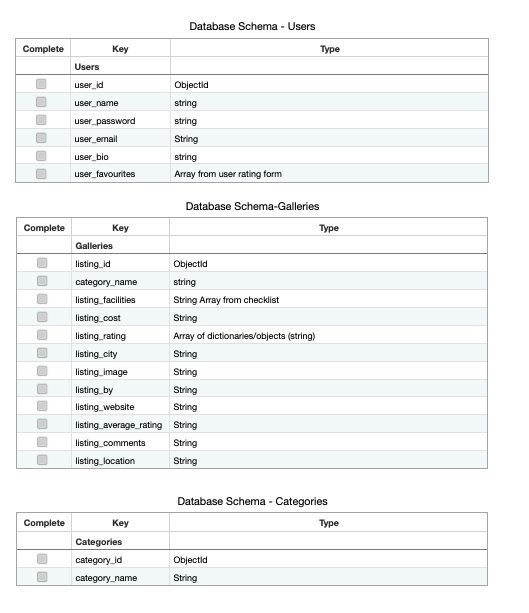

<h1 align="center">Culturate</h1>
-------

[View the live project here.](https://culturate.herokuapp.com/)

Culturate is a cultural places, exhibitions and events site. It is designed to be responsive and accessible on a range of devices, making it easy to navigate for potential contributors and people looking for information across a number of devices.

## UX

### Strategy
-------

#### Accessibility 
-------
#### Security
-------

#### User Goals
-------
#### User Stories - First Time User A (Community User)
-------
1. As a **First time user**, I want to have a clear visual impact on landing on the site to demonstrate the **artistic** / **cultual sharing** & **listing** purpose of the site. 
2. As a **First time user**, I want to be able to **browse at least some listings** without having to sign up / login. 
3. As a **First time user** I want to be able to **join** the community **easily and securely** 

#### User Stories - Existing User B (Community User)
-------
1. As an **Existing User** I want to be able to **login** easily. 
2. As an **Existing User** I want a **Personalised experience** by being able to **like** and **save listings** for future reference.  
3. As an **Existing User** I would like to be **addessed by my username**
4. As an **Existing User** I would like to be able to **upload listings** for others to see. 
5. As an **Existing User** I would like to be able to **share interesting finds directly on social media**

##### User Stories - Repeat/ Frequent User C (Logged in / joined member)
1. As a **Repeat User** I would like to be able to **edit my likes and saves** 
2. As a **Repeat User** I would like to be able to **search the listings** 
3. As a **Repeat User** I would like to be able to **edit and update my profile**
4. As a **Repeat User** I would like to be able to **edit or update the comments on my listings**
5. As a **Repeat User** I would like to be able to **contact the website owners** to suggest new listing categories. 

#### User Stories - Site Manager / Admin User D
-----
1. As a **Site Manager / Admin User** I want to be able to **create new categories**
2. As a **Site Manager / Admin User** I want to be able to **edit / delete listings** if necessary. 
2. As a **Site Manager / Admin User** I want to be able to **edit / users** if necessary. 
3. As a **Site Manager / Admin User** I want to ensure that the website **stays up to date**, and **automatically deletes** events that have passed. 

### Scope
-----
#### Core Features
-----
#### Feature Feasibility *MVP vs Full Features
-----
#### 1st Round Selected Production Features 
-----
#### Future Implementations
-----
#### Content and Structure requirements
-----

### Structure
#### Conceptual Design 
* I used Lucid Chart to put together a flow chart of the relationships between the data and actions taken by users as an initial guide to aide the design process.  

* This also helped to identify secutiry measures to be taken into account, and which CRUD operations are performed by which user - The flow was slightly modified throughout design to satisfy the user stories.  The 'liked/saved' block also represents the read part of CRUD. 
#### Database Schema
* Original database Schema design consisted of 3 collections in MongoDB Users, Galleries, Categories: 

* In the practicality of actually constructing the user journeys and features it was necessary to edit the schema to include more generic term listings instead of galleries so that on-page semantics were correct.  
* As well as this, there was the need to add array of dictionaries to store the user-ratings. During the process of the project, I also solidified the terminology and named the final schema in a more semantically correct manner.
* Final Schema was still 3 collections and during the project I learnt how to access the sub-collections:

#### User Journey Map
##### User Journey Map *First time User
##### User Journey Map *Existing User (Logged in / joined member)
##### User Journey Map *Existing User (Not Logged in / Brower user)
##### User Journey Map *Site Manager / Admin User 
#### Necessary Elements 

### Skeleton
#### Element arrangement considerations
#### User feedback arrangements
#### Arguments for AB testing 
#### Wireframes / Prototypes

### Surface
#### Design Inspiration

##### Mood Board & Colour choices
##### Typography
##### Imagery

## Implementation 

## Technologies Used

### Languages Used

*  [HTML5](https://en.wikipedia.org/wiki/HTML5)
*  [CSS3](https://en.wikipedia.org/wiki/Cascading_Style_Sheets)
*  [Javascript]
*  [Python3] (https://www.python.org/)

### Frameworks, Libraries & Programs Used

*  [Jinja] (https://en.wikipedia.org/wiki/Jinja_(template_engine))
*  [MaterializeCSS] (https://materializecss.com/) is used as a css framework to ensure responsive design delivery within the timeframe. 
*  [Heroku](https://www.heroku.com) is the cloud-based platform used to deploy the project. 
*  [MongoDB](https://www.mongodb.com) is used for the document database.
*  [Flask] (https://en.wikipedia.org/wiki/Flask_(web_framework)) is used as a micro-framework and supports the use of Jinja templates. 
*  [Figma] (https://www.figma.com/)
*  [JQuery] (https://jquery.com/)
*  [Hover.css](https://ianlunn.github.io/Hover/) I used hover to make elements more interactive.
*  [Google Fonts](https://fonts.google.com/) 
*  [Font Awesome](https://fontawesome.com/) Font awesome is where I sourced all the icons for the site.
*  [GitHub](https://github.com/) is used to file the repository and record the version control. 
*  [GitPod](https://gitpod.io) was used for development and version control.

)

## Testing

Detailed testing documentation can be found in [TESTING.MD] (/workspace/culturate/TESTING.MD)

### Known Bugs

## Deployment

### Forking the GitHub Repository

### Making a Local Clone

### Credits
* Content
* Media
* default image (if no listing image uploaded) https://www.isupportstreetart.com/students-benefit-street-art/

### Acknowledgements
