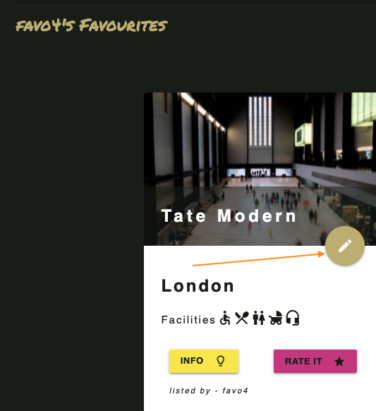
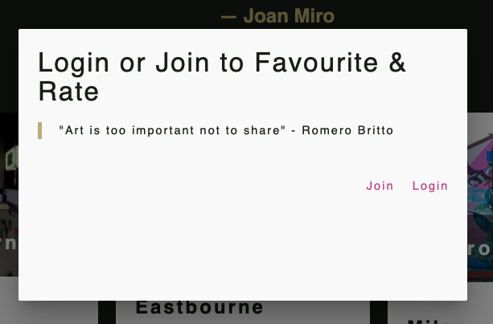

<h1 align="center">Culturate</h1>
-------

[View the live project here.](https://culturate.herokuapp.com/)

Culturate is a cultural places, exhibitions and events site.  It is designed to be responsive and accessible on a range of devices, making it easy to navigate for potential contributors and people looking for information across a number of devices.

# Table of Contents
------
* Strategy
    * User Stories 
    * Website Owner Goals
* Scope
    * Product Objectives & Functional Requirements
    * Security
    * Data Management
* Content and Structure requirements
    * Structure
        * Conceptual Design
        * Database Schema
    * Skeleton 
        * Wireframes
        * Surface & Prototypes
        * Design Inspiration and color choices
        * Typography
        * Imagery
* Core Features
* Future Implementations
* Bugs & Fixes
* Implementation
* Deployment
    * To deploy to Heroku
    * Forking the GitHub Repository
    * Making a Local Clone
* Testing
* Technologies Used 
    * Languages Used
    * Frameworks, Libraries, Programs & Platforms Used
* Credits
* Acknowledgements

-----

## Strategy 
-------
#### User Stories - First Time User A (Community User)
-------
1. As a **First time user**, I want to have a clear visual impact on landing on the site to demonstrate the **artistic** / **cultual sharing** & **listing** purpose of the site. 
2. As a **First time user**, I want to be able to **browse at least some listings** without having to sign up / login. 
3. As a **First time user** I want to be able to **join** the community **easily and securely** 

#### User Stories - Existing User B (Community User)
-------
1. As an **Existing User** I want to be able to **login** easily. 
2. As an **Existing User** I want a **Personalised experience** by being able to **like** or **save listings** for future reference.  
3. As an **Existing User** I would like to be **addressed by my username**
4. As an **Existing User** I would like to be able to **upload listings** for others to see. 

#### User Stories - Repeat/ Frequent User C (Logged in / joined member)
1. As a **Repeat User** I would like to be able to **edit my likes and saves** 
2. As a **Repeat User** I would like to be able to **search the listings** 
3. As a **Repeat User** I would like to be able to **edit and update my profile**
4. As a **Repeat User** I would like to be able to **edit or update the listings that I added**

#### User Stories - Site Manager / Admin User D
-----
1. As a **Site Manager / Admin User** I want to be able to **create new categories**
2. As a **Site Manager / Admin User** I want to be able to **edit / delete listings** if necessary. 
3. As a **Site Manager / Admin User** I want to be able to **edit / users** if necessary. 
4. As a **Site Manager / Admin User** I want to ensure that the website **stays up to date**, and that any inappropriate comments can be deleted if necessary - although the main point is for all users to have their say. 

#### Website Owner Goals
------
* The possibility to in the future gain commission from being a referrals site if the site were to become popular.  For this to happen, the site must look polised and have great UX for user buy-in. 

#### Product Objectives & Functional Requirements
------

* Listing pages that can store **user ratings** and **be favourited** by the user. 
* Easy UI to **upload listings**
* **Admin dashboard/ admin access** to be able to monitor and edit content. 

#### Scope 
* Responsive layout to ensure **optimal visuals**
* The site must **store data securely**
* The administrator must be able to access data through the website to edit or delete the records of users or listings. 
* The website should be able to function as close as possible to the following user-story based functional feature requirements:

* The website should aim to have good browser performance and follow accessibility guidelines

#### Security
* The details that will be handled in this project are user email.  This will be dealt with by installing Werkseug password hash and check password hass into the flask app. 
* For the security of the data over-all the data is stored in Mongo DB.  The application connects to Mongo DB, but the connection passwords anre protected in the Gitignore file. 
* To enure the correct level access, session storage is used as well as re-directs to minimise the possibility of users accessing areas of the site they should not. 

#### Data Management
* The site is using crud functionality, and in order for these Create, Read, Update & Delete functions to provide a good user experience it is necessary for:
* **alerts** to be used 
* ensure there is **no one step deletion** of data
* **access** functionality managed through app routes and jinja templating to make use of session user cookes, but also data matching

#### Content and Structure requirements
-----

### Structure
#### Conceptual Design 
* I used Lucid Chart to put together a flow chart of the relationships between the data and actions taken by users as an initial guide to aide the design process.  

* This also helped to identify secutiry measures to be taken into account, and which CRUD operations are performed by which user - The flow was slightly modified throughout design to satisfy the user stories.  The 'liked/saved' block also represents the read part of CRUD. 

#### Database Schema
* Original database Schema design consisted of 3 collections in MongoDB Users, Galleries, Categories: 

* In the practicality of actually constructing the user journeys and features it was necessary to edit the schema to include more generic term listings instead of galleries so that on-page semantics were correct and avoiding creation on unnecessary additional collections
* As well as this, there was the need to add array of dictionaries to store the user-ratings. During the process of the project, I also solidified the terminology and named the final schema in a more semantically correct manner.
* Final Schema was still 3 collections and during the project I learnt how to access the sub-collections:

### Skeleton
------

#### Wireframes 

* The initial designs were sketched out of Balsamiq with some of the form views being the same across device sizes to ensure more impact on the visual pages such as the listing pages.  
* Here are the wireframes for the skeleton design planning:

#### Homepage - Desktop

#### Homepage - IPad

#### Homepage - Mobile

#### Forms - A uniform design applicable across all devices

#### Forms - Ipad example

#### Categories - Desktop

#### Categories - Ipad

#### Categories - Mobile

### Surface & Prototypes
* I then wanted to get an idea of how the colours and imagery would work so I did some planning on Figma too - I just selected a few key pages to illustrate an idea of houw the colours would come out:

#### Figma Prototypes

#### Design Inspiration & Colour choices 
* The over-all concept came from the anticipation of getting out to access cultural activities after the lockdown period.  
My hometown of Eastbourne has an inspirational gallery - the Towner Gallery, which is painted in rainbow by artist Iothar Gotz.  
I used an image of the gallery for landing page, and took colour design inspiration from this pallet - offering an alternative to the sometimes staid and serious gallery website design approach to give a vibrant design feel that will appeal to multiple user-groups and elicit a vibrant positive feeling for users. 

I translated the colour pallet using Coolors to get the hex and RGB codes to use in CSS:

#### Typography
* For the Typography, it was necessary to chose classically no nonsense font, so I chose **Archivo**, but to complement for forms (where information is being shared) and profile pages where the user is likely to be already an engager used, I chose **Permanenet Marker** to personalise. 

##### Imagery
The Imagery of the website will be based on the user contributions, but to set the theme, the homepage is a parallax containing two striking colourful artworks. 
Where there may be times where an image is not uploaded, there is a standby image to populate incase. 

#### Core Features
-----

* I decided to segment my features out into their various CRUD operations to ensure that the features were related and could be tested thoroughly. 
 This can be seen in better detail in the following link [feature-testing](static/testing/final/user-and-functional/feature-testing-complete.png)

* The visual inperpretations of the features are detailed below. 

* A **Listings page** with  **Listing cards** that represent the data in an attractive and succinct format - Exampled in the belw screen-shot;
#### Here is an example of the listings page - 
------

 

* Click through to more **detailed listing page** to contain the **ratings and info**. 
#### Here is an example of a listing page - 
------

 
* Option to **create a profile** 
    * For non-logged in users, there are various directions to prompt the user to login, from the nav, from the landing page and also incase they try to login without a profile, at the bottom of the login page.  
#### Here is an example of the join form - 
----- 

* Ability to **upload a listing**
    * From the nav bar, the user can choose to add a listing
#### Here is an example of the add listing form - 
-----

* Ability to **edit a previously uploaded listing**
    * The ability to edit a listing is available to both the author of the listing and the admin.  If the user is logged in as either of these they will see an edit button instead of a favourite button on the listing card whether in listing, profile, or listin_page view.

#### Here is an example of the edit button - 
-----

    * The edit listing form comes pre-populated with the existing data to ensure that the user does not wipe over their existing data without intentionally doing so. 
#### Here is an example of the edit form - 
-----

* Ability to **favourite items** and **un-favourite**
    * This feature is very simple for the user to user - The heat button serves ar a favourite button that adds the listing to an array of user favourties in the db.  If the button is clicked again, the listing is removes from the favourites list.  The user is kept informed of the status at each click with a a flash message. 
    * The user favourites are added to the user's profile page.

#### Here is an example of the favourite button - 
-----

* Ability to **leave a rating**
    * The user can rate a listing by using the rate-it button which is visibile on the listings page, the listing_page, of within the profile cards. 
    * If the user is not logged in, they are show a different modal giving them links to join or login to rate. 
#### Here is an example of the ratings modal - 
-----

#### Here is an example of the login modal - 
-----

* Search to be able to **search listings** by any data included in the listing only.  The search feature is avilable on both the listings page and from directly within the profile. 

#### Here is an example of the search section - desktop view
-----

#### Here is an example of the validation in action - 
-----
* **Validation rules and alerts** for data that is uploaded to the db, each field onn each form has validation rules for presence (if it has been completed or not), format(whether is should be text / url/ email etc) & range(max and or min length).  If these rules are not complied with the forms will not submit, and the user gets prompted. 

* An **admin dashboard** for administrators of the site.  The admin dashboard is intended as a quick and personalised route for the administrator to perform standard tasks from the dropdown; 
    
    
    * search (if the admin wants to edit a particular listing)
    

    * access user records

    
    * quick link to manage categories

    

* Preventative **validation** measures to ensure un-validated data is not submitted to the database and to **inform the user** if theya re missing out on amy required steps. 

#### Future Implementations
-----
* More in-depth **security functions** 
* A **request form** for new categories
* Maps **API instead of Embed**
* Use a **CDN for storing and serving images faster** and for the user to be able to upload a file rather than a URL
* Incorporate social sharing

#### Homepage 

#### Here is an example of a listing page:
 

You will see that I decided to dial back the yellow, and keep most backgrounds aside from forms with the #1a2017 and use the colour as pops, letting the art imagery sign it's own song. 

# Bugs and Fixes - Projects learnings. 
-----
* I learnt a lot on this project regarding how to structure the time and save time in the future.  My methodology was to get the basic framework and all pages up, then perfect the CSS & formatting after the routing was in place.  However this meant that with various changes to elements and fixes to be applied to more than one page meant that the timescale expanded.  Next time I would create fully one page of each - for example one add page, one submit page, one cards page, then have these fully functional and formatted with final routings and css before duplicating elements to other pages.  The following chart shows the major bug issues and related git commits and can also be seen up close in the following link [bugs/fixes](static/testing/final/user-and-functional/bugs-fixes-complete.png):

 

## Implementation
-----

This project is a uses the flask framwork, which is a framwork that is written in Python  app has been built and source-controlled on GitHub with regular commits. The backend is managed in MongoDB and the project is deployed to Heroku. 

## Deployment
-----

### To deploy to Heroku
 * To deply to Heroku it is first necessary to create and app on Heroku to link to from your repositry in github and in the settings tab set up your config vars with the details relevant to your database and project: 
 * 

---
Once an app is created on Heroku, To deploy the project to Heroku from Git, I used the following steps:

1. Before attempting to deploy - check that your commits are pushed to Git Hub.  
2. Before attempting to push to Heroku, check that your requirements.txt and Procfile are set up.
3. Log into Heroku
4. Click on the deploy tab
5. Select Github as deployment method 

6. Add the correct github repository that you want to deploy to connect and click connect
7. To automate each time a new git push is made, click 'enable automatic deploys'.  The defualt is master branch - In this image the button has already been clicked. 

8. Finally in the manual deploy section - click deploy branch button.  This can also be used any time there is a problem with automatic deployment.

### Forking the GitHub Repository
To make a copy of the repository, which may be necessary if you wish to make changes without affecting the original using this method;

1. Ensure you are logged in to GitHub
2. The Fork button is on the top right of the page, above settings and below your github icon. Click on it to make a copy of the original.

## Technologies Used
-----
### Languages Used
-----

*  [HTML5](https://en.wikipedia.org/wiki/HTML5)
*  [CSS3](https://en.wikipedia.org/wiki/Cascading_Style_Sheets)
*  [Javascript](https://www.javascript.com/)
*  [Python3](https://www.python.org/)

### Frameworks, Libraries, Programs & Platforms Used
-----
*  [Jinja](https://en.wikipedia.org/wiki/Jinja_(template_engine)) is used to render templates into the base html and access the routing applied in the python files. 
*  [MaterializeCSS](https://materializecss.com/) is used as a css framework to ensure responsive design delivery within the timeframe. 

*  [MongoDB](https://www.mongodb.com) is used for the document database storage to store and return to the front end initial data structure as well as inputs from the end user (for example ratings / user info). 
*  [Flask](https://en.wikipedia.org/wiki/Flask_(web_framework)) is used as a micro-framework and supports the use of Jinja templates. 
*  [Figma](https://www.figma.com/) is used to illustrate the prototypes to visualise the look of the finished pages prior to coding. 
*  [JQuery](https://jquery.com/) is used mainly to activate elements in the materialise CSS. 
*  [Hover.css](https://ianlunn.github.io/Hover/) I used hover to make elements more interactive.
*  [Google Fonts](https://fonts.google.com/) Is used to serve the archivo and permanenet marker fonts used throughout the project
*  
*  [GitHub](https://github.com/) is used to file the repository and record the version control. 
*  [GitPod](https://gitpod.io) was used for development and version control.
*  [Heroku](https://www.heroku.com) is the cloud-based platform used to deploy the project. 

#### Testing
-----
Detailed testings has been carried out for functionality, usability and responsiveness which are documented in [Testing](TESTING.md) with supporting documentation and testing results available in the [testing folder](static/testing)

### Credits
-----
* Content - created by site owner and family and friend testers submiting listings and ratings. 
### Media
* Default image (if no listing image uploaded) [I support street art](https://www.isupportstreetart.com/students-benefit-street-art/)
* Homepage images:
    * top: Image of Towner Gallery Eastbourne by [Marc Atkins](https://www.townereastbourne.org.uk/wp-content/uploads/Home-apge-slide-dance-diagonal-%C2%A9-Marc-Atkins-46.jpg)
    * bottom: Image found in corriere [Courtesy Or.Me – Ortica Memoria](https://static2-living.corriereobjects.it/wp-content/uploads/2021/01/floreale-660x440.jpg)
* Listing images are url links to the original image. 

### Acknowledgements
-----
* The foundational learings from this site came from the [Code Institute](https://codeinstitute.net/) Task Manager walkthrough project.  The concepts and structure of which have been substantially modified to create this project. 
* The tutor support team at [Code Institute](https://codeinstitute.net/) have been extremely helpful when bugs could not be solved independently.  Particular shout-outs to Igor, Jo, and Sheryl. 
* The CI [Slack](https://slack.com/intl/en-it/) channel have been an excellent source of peer comment and suggestions.  Thanks to [Sean Young](https://github.com/seanyoung247) for helping me figure out the issue with my favourites form submission. 
* Thanks to my mentor [Gurjot Singh](https://github.com/gurjot-in) for continued support and patience. 
