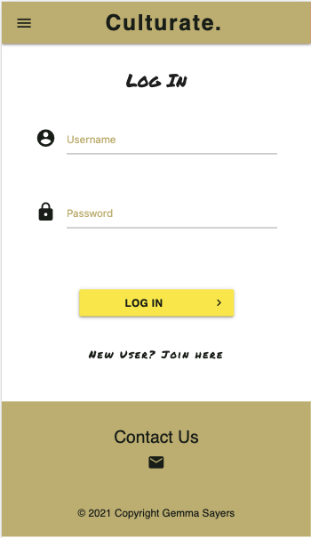
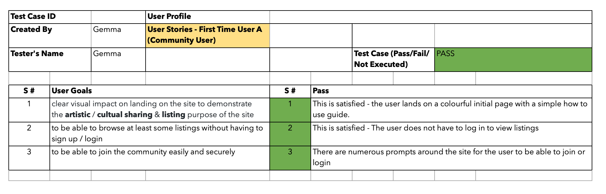
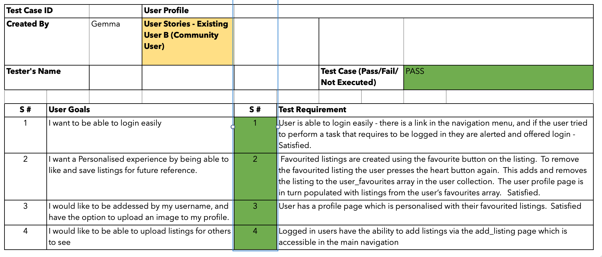
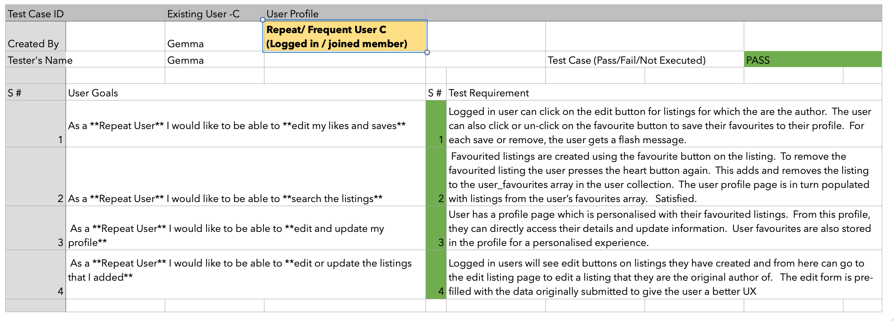

<h1 align="center">Culturate - Testing</h1>
-------

[View the live project here.](https://culturate.herokuapp.com/)

Culturate is a cultural places, exhibitions and events site.  It is designed to be responsive and accessible on a range of devices, making it easy to navigate for potential contributors and people looking for information across a number of devices.

### Testing User Stories from User Experience (UX) Section

### User Stories - First Time User A (Community User)
-------
1. As a **First time user**, I want to have a clear visual impact on landing on the site to demonstrate the **artistic** / **cultual sharing** & **listing** purpose of the site. 

#### Visual example (homepage):

2. As a **First time user**, I want to be able to **browse at least some listings** without having to sign up / login. 

#### Visual example (listings page):

* This page is accessible to all users to browse without having to log in first:

3. As a **First time user** I want to be able to **join** the community **easily and securely** 

#### Visual example (listings page):
* The password in enctypted, so that when it reaches the database, it is not legible to users of the database.  The form validation has been applied to ensure no empty fields and there is a charachter length limit to avoid spam. 

#### Final testing record for First Time User A (Community User)

This testing was performed by manually going through all the associated functionalities - detailed associated features and acccompanying bug testing detailed below in Feature testing and Bug fixes

#### User Stories - Existing User B (Community User)
-------
1. As an **Existing User** I want to be able to **login** easily. 
2. As an **Existing User** I want a **Personalised experience** by being able to **like** or **save listings** for future reference.  
3. As an **Existing User** I would like to be **addressed by my username**
4. As an **Existing User** I would like to be able to **upload listings** for others to see. 

#### Final testing record for Existing User B (Community User)

#### User Stories - Repeat/ Frequent User C (Logged in / joined member)
1. As a **Repeat User** I would like to be able to **edit my likes and saves** 
2. As a **Repeat User** I would like to be able to **search the listings** 
3. As a **Repeat User** I would like to be able to **edit and update my profile**
4. As a **Repeat User** I would like to be able to **edit or update the listings that I added**

#### Final testing record for Existing User C (Community User)

#### User Stories - Site Manager / Admin User D
-----
1. As a **Site Manager / Admin User** I want to be able to **create new categories**
2. As a **Site Manager / Admin User** I want to be able to **edit / delete listings** if necessary. 
3. As a **Site Manager / Admin User** I want to be able to **edit / users** if necessary. 
4. As a **Site Manager / Admin User** I want to ensure that the website **stays up to date**, and that any inappropriate comments can be deleted if necessary - although the main point is for all users to have their say. 

#### Final testing record for Existing User C (Community User)

### Browser Testing 
### Device Testing
### Lighthouse Testing 
### Accessibility Testing 
