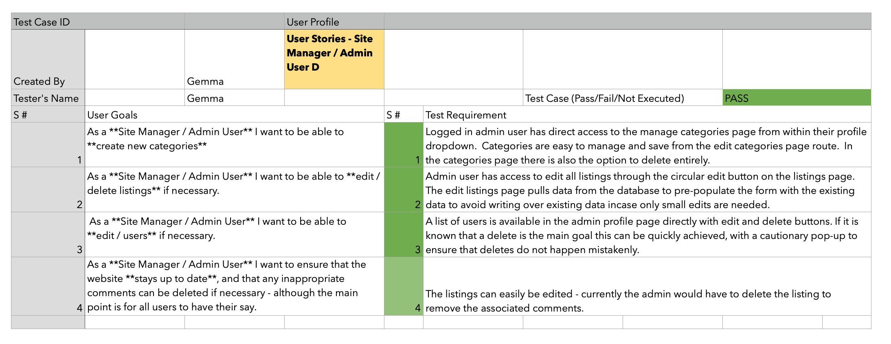
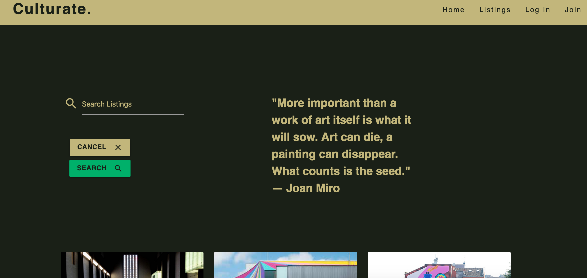
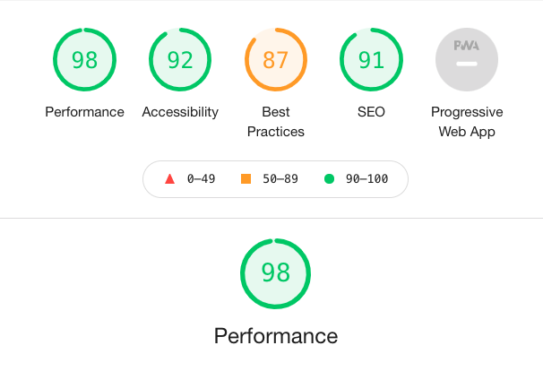
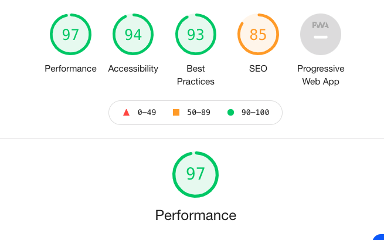

<h1 align="center">Culturate - Testing</h1>
-------

[View the live project here.](https://culturate.herokuapp.com/)

Culturate is a cultural places, exhibitions and events site.  It is designed to be responsive and accessible on a range of devices, making it easy to navigate for potential contributors and people looking for information across a number of devices.

## Testing User Stories from User Experience (UX) Section
------

### User Stories - First Time User A (Community User)
-------
1. As a **First time user**, I want to have a clear visual impact on landing on the site to demonstrate the **artistic** / **cultual sharing** & **listing** purpose of the site. 

#### Visual example (homepage):

2. As a **First time user**, I want to be able to **browse at least some listings** without having to sign up / login. 

#### Visual example (listings page):

* This page is accessible to all users to browse without having to log in first:

3. As a **First time user** I want to be able to **join** the community **easily and securely** 

#### Visual example (listings page):
* The password in enctypted, so that when it reaches the database, it is not legible to users of the database.  The form validation has been applied to ensure no empty fields and there is a charachter length limit to avoid spam. 

#### Final testing record for First Time User A (Community User)

This testing was performed by manually going through all the associated functionalities - detailed associated features and acccompanying bug testing detailed below in Feature testing and Bug fixes

#### User Stories - Existing User B (Community User)
-------
1. As an **Existing User** I want to be able to **login** easily. 
2. As an **Existing User** I want a **Personalised experience** by being able to **like** or **save listings** for future reference.  
3. As an **Existing User** I would like to be **addressed by my username**
4. As an **Existing User** I would like to be able to **upload listings** for others to see. 

#### Final testing record for Existing User B (Community User)
-------

#### User Stories - Repeat/ Frequent User C (Logged in / joined member)
------
1. As a **Repeat User** I would like to be able to **edit my likes and saves** 
2. As a **Repeat User** I would like to be able to **search the listings** 
3. As a **Repeat User** I would like to be able to **edit and update my profile**
4. As a **Repeat User** I would like to be able to **edit or update the listings that I added**

#### Final testing record for Existing User C (Community User)
-------

#### User Stories - Site Manager / Admin User D
-----
1. As a **Site Manager / Admin User** I want to be able to **create new categories**
2. As a **Site Manager / Admin User** I want to be able to **edit / delete listings** if necessary. 
3. As a **Site Manager / Admin User** I want to be able to **edit / users** if necessary. 
4. As a **Site Manager / Admin User** I want to ensure that the website **stays up to date**, and that any inappropriate comments can be deleted if necessary - although the main point is for all users to have their say. 

#### Final testing record for Admin User D (Community User)

#### Final 

### Browser Testing 
* Main testing trhoughout the project was carried out on Chrome and Safari.  The site has also been tested on Microsoft Edge and Firefox from desktop view - all functioning as expected and no visible difference in functionality or display. 

### Device Testing & Responsiveness
* Devices used for testing:
    * Macbook Air
    * Iphone 11 plus
    * Iphone 6 
    * IPhone SE
    * Samsung phone (model unknown)
    * Ipad pro
* There were considerable challenges to over-come with the diplay of the cards as detailed in the bug fixing section. Primarily, the cards were displaying gaps on larger devices, then during the fixing efforts, the buttons began to over-hang and cards over-lap on smaller devices.  
* As well as using the physical devices, the Google dev tools was used to visualise the responsiveness in an Iphone 6 plus and for larger desktops.  and the finished product provides a responsive experience for all devices tested. 
* For larger devices, the space srrounding the search bar provides an artistic quote for better user experience. 

### Lighthouse Testing 
-----
* sample pages have been checked during the development process using the google lighthouse tool, with improvements being made along the way to improve the ratings. 
* The final scores are as follows for the 3 main pages and more detailed reports can be found here [lighthouse final tests](static/testing/final/lighthouse):

### Home Page 

### Listings Page

### Listing Page

### Validator Testing 
* Code has been passed through HTML, CSS, JSHINT & Pylint validators for the final code - all resulting in passes eventually. 
* There were some issues to overcome, with lists and divs nesting errors as well as duplicate names and id's.  
* The full validation testing pre-fix can be found here: [Initial Validator Results](static/testing/initial/validator)
* The full validation testing pass results can be found here: [Final validation results](static/testing/final)

